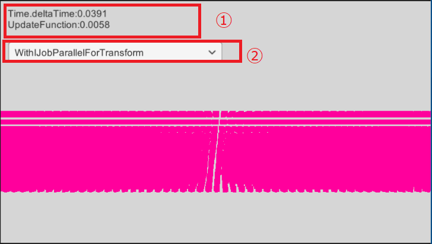
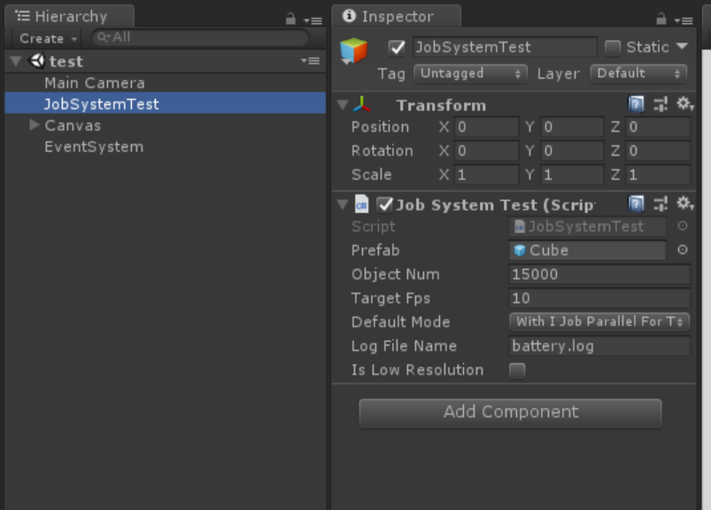
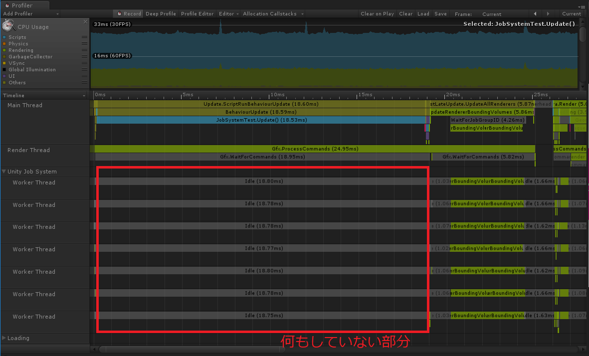
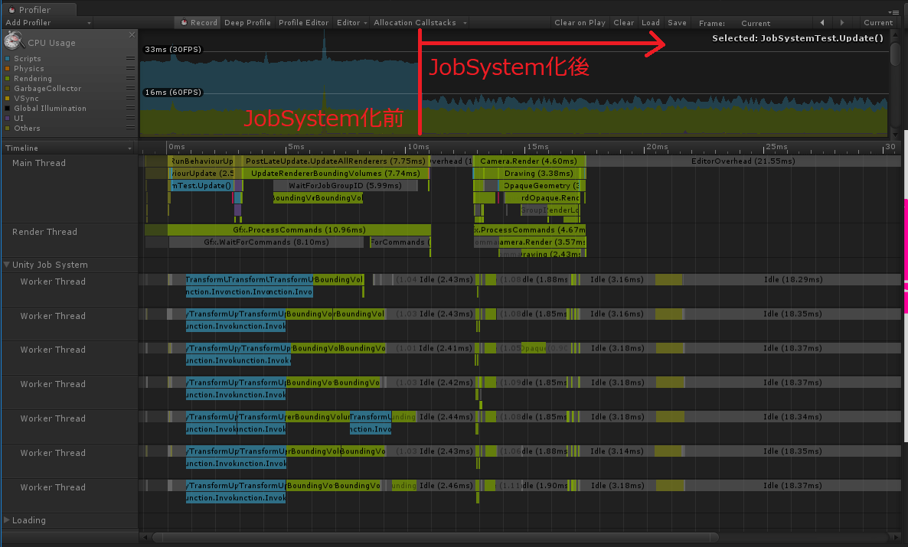

# プロジェクトについて
このプロジェクトは Unity 2018.1から導入された JobSystemのテスト用プログラムです。

# 内容について
沢山のGameObject ( 5万個のSphere )を毎フレーム動かすテストです。 
いくつかのパターンの処理を用意していて、どれが一番早そうかをテスト出来ます。 
実行中に処理のパターンを切り替えられるようにしていますので、どの位効果が出るかを即時確認できるようにしています 

実機でテストした所、Android/iOSでも処理の高速化が確認できます。

# 実行画面

沢山のピンク色のオブジェクトを動かすだけの単純なプログラムです。 
①処理にかかった時間を表示しています。 
　Time.deltaTimeとUpdate関数にかかった時間の二つを表示しています。 
②ここで、処理の方式を切り替えます 
　パターンについては下記を参照してください 

# パターンについて

## 1.DirectTransform
計算した結果を素直に transform.position / transform.rotationに代入していくやり方です。 
全てがMain Thread上で行われます。

## 2.TransformAndRotation
計算した結果を素直に transform.SetPositionAndRotationで代入していくやり方です 
全てがMain Thread上で行われます。

## 3.WithJobParallelForTransform
IJobParallelForTransformを利用して並行して、transformを動かします。 
Jobを活用した形の方法です。 
Update関数内で全てのtransform更新処理が終わる前提でやっています。

## 4.WithJobParallelForTransformByNextFrame
IJobParallelForTransformを継承したstructで並行してtransformを動かしています。 
「次のフレームまでにTransform更新処理が終わっていると良い」という処理で、もっとも高速に動く処理です。

## 5.WithJobParallelFor
IJobParallelFor側でposition/rotationの計算を行い、最終結果をMainThread側でセットする方法です。 
座標計算計算部分だけをJob化して、最後の処理はMainThread側で動きます.

# 設定について

testシーン中にある「JobSystemTest」オブジェクトの値を弄る事で条件を色々テストすることが出来ます

<pre>
Prefab ：動かす対象のPrefabです。
ObjectNum : 生成するオブジェクト数を指定します
DefaultMode : 起動直後のパターンを保存します

その他：モバイル環境のバッテリー消費具合を調べる時に利用しました。
　　　　こちらで調査した所、Job化して処理が高速化することで バッテリー消費が若干抑えられました。

</pre>

# 結果

